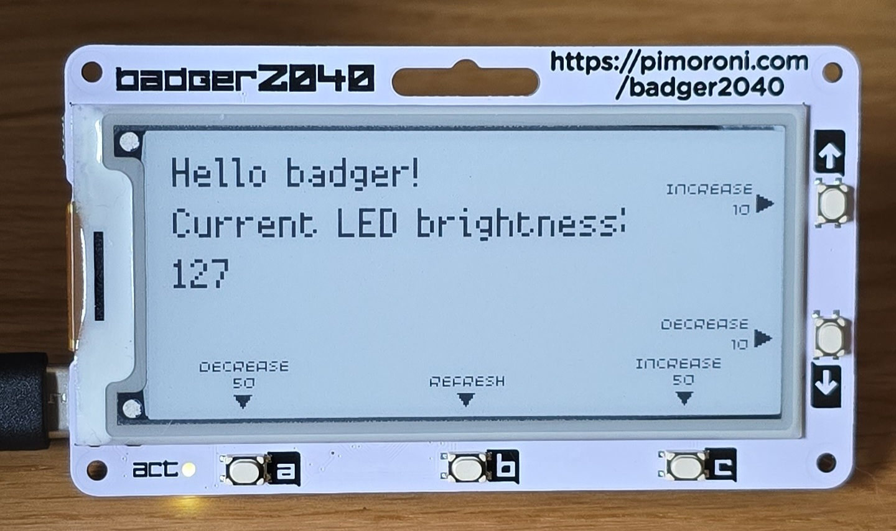

# Badger 2040 Examples

## About

Some example projects created to test out and learn how to use the Badger 2040 device.

## How to run

Follow official guide for setup: [Getting started with Badger 2040](https://learn.pimoroni.com/article/getting-started-with-badger-2040)

TLDR: Install `thonny` pip package, connect Badger to system, use Thonny IDE to connect to and program the Badger.

## Examples

### 1. LED Test

Simple project utilizing button reads, text, partial updates, and the LED on the Badger 2040.

Not sure what's up with the camera.
